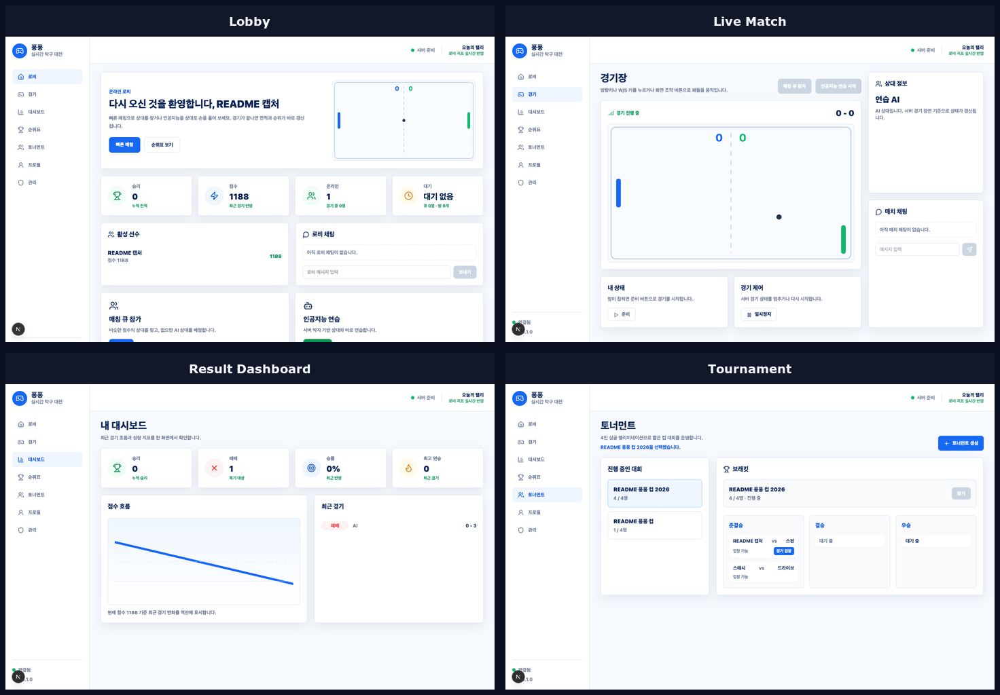

# Pong Pong


`pong-pong`은 42 `ft_transcendence` 과제를 변형한 TypeScript monorepo 프로젝트입니다. 브라우저는 입력만 보내고 서버가 공의 위치, 충돌, 점수와 승패를 계산하는 실시간 Pong 서비스입니다. HTTP와 WebSocket은 같은 Zod 계약을 사용하며 경기 결과는 서버가 한 번만 확정해 저장합니다.

로비와 실시간 매칭, 관전자에게도 동일한 경기 상태를 전달하는 room session, 채팅, 전적·순위표, 친구, 토너먼트와 관리자 기능을 하나의 workspace로 구성합니다.



## 한눈에 보기

| 항목 | 내용 |
| --- | --- |
| 웹 | Next.js App Router |
| API | Fastify |
| 실시간 전송 | WebSocket (`ws`) |
| 데이터베이스 | PostgreSQL 또는 개발용 메모리 저장소 |
| 공유 계약 | Zod 기반 HTTP·WebSocket·경기 상태 schema |
| 경기 판정 | 서버 권위형 simulation |
| 실행 구성 | pnpm workspace, Docker Compose, Caddy |
| 주요 검증 | 단위·계약·PostgreSQL 통합·HTTP/WS smoke·E2E·부하·장애 주입 |

## 저장소 구성

```text
packages/
├── shared/      # HTTP·WebSocket·경기 상태 Zod 계약
└── db/          # PostgreSQL migration, 저장소 구현과 메모리 저장소

apps/
├── api/         # Fastify HTTP·WebSocket 서버와 경기 실행
└── web/         # Next.js 로비, 경기장, 대시보드, 순위표와 토너먼트
```

핵심 실행 객체는 다음과 같습니다.

| 구성 요소 | 역할 |
| --- | --- |
| `PongSimulation` | 입력을 시간 단계에 적용하고 공·패들·점수 상태 계산 |
| `RoomSession` | 대기·진행·종료 상태와 참가자 연결 관리 |
| `Matchmaker` | 등록 사용자와 비회원의 매칭 규칙 적용 |
| `SharedRoomScheduler` | 실행 중인 방을 같은 주기로 순회 |
| repository | 사용자·관계·토너먼트·경기 결과 저장 |

## 경기 처리 구조

```text
브라우저 입력
  -> WebSocket message 계약 검증
  -> RoomSession의 현재 참가자·상태 확인
  -> 다음 simulation tick에 입력 반영
  -> PongSimulation이 위치·충돌·점수 계산
  -> server snapshot 생성
  -> 방 참가자에게 broadcast
  -> 브라우저가 snapshot 사이를 화면에서 보간
  -> 승패 확정 시 repository에 결과 한 번 기록
```

브라우저는 패들 입력을 보내고 snapshot 사이를 부드럽게 보간하지만 점수와 승패를 직접 판정하지 않습니다. 네트워크 지연이나 브라우저 프레임 속도가 경기 결과의 기준이 되지 않습니다.

## 실행 환경

다음 버전을 저장소 설정과 lockfile에서 고정합니다.

| 도구 | 버전 |
| --- | --- |
| Node.js | `24.18.1` |
| pnpm | `10.32.1` |
| Next.js | `15.5.23` |
| Fastify | `5.11.3` |
| `ws` | `8.21.0` |

```sh
corepack enable
pnpm install --frozen-lockfile
```

`APP_MODE`와 `DATABASE_URL`은 API 프로세스 시작 시 읽습니다. `NEXT_PUBLIC_API_BASE_URL`, `NEXT_PUBLIC_WS_URL`, `NEXT_PUBLIC_APP_MODE`는 Next.js 빌드 결과에 포함됩니다. 공개 URL이나 mode를 바꿨다면 web image를 다시 빌드해야 합니다.

## 등록 사용자 개발 환경

`development` mode는 `/auth/dev-login`을 열어 등록 사용자 기능을 확인할 수 있게 합니다.

```sh
POSTGRES_PASSWORD=local-pong-password \
SESSION_SECRET=local-session-secret-at-least-32-bytes \
APP_MODE=development \
  docker compose up --build -d
```

Compose의 migration 작업은 schema만 준비합니다. NPC와 예시 사용자가 필요하면 seed를 별도로 실행합니다.

```sh
POSTGRES_PASSWORD=local-pong-password \
SESSION_SECRET=local-session-secret-at-least-32-bytes \
APP_MODE=development \
  docker compose run --rm api node packages/db/dist/cli.js seed:dev
```

기본 공개 주소는 `http://localhost:8080`입니다. Compose의 `8080:8080`은 host IP를 생략하므로 Caddy가 모든 host interface에 port를 게시합니다. 원격 주소에서 사용할 때는 `PUBLIC_ORIGIN`, `PUBLIC_WS_URL`과 web build 값을 함께 맞춰야 합니다.

서비스를 내립니다.

```sh
POSTGRES_PASSWORD=local-pong-password \
SESSION_SECRET=local-session-secret-at-least-32-bytes \
APP_MODE=development \
  docker compose down --remove-orphans
```

## 관리자 개발 경로

개발 로그인으로 session을 만든 뒤 같은 handle의 role을 바꿀 수 있습니다.

```sh
POSTGRES_PASSWORD=local-pong-password \
SESSION_SECRET=local-session-secret-at-least-32-bytes \
APP_MODE=development \
  docker compose run --rm api \
    node packages/db/dist/cli.js user:set-role <로그인한-handle> admin
```

다음 session 조회부터 repository의 최신 role을 읽습니다. 자신을 ban하면 같은 session으로 해제할 수 없으므로 다른 active admin이나 직접 DB 복구가 필요합니다.

## 비회원 체험 환경

`demo` mode는 회원 계정 없이 비회원 PvP를 시작하고, 상대가 나타나지 않으면 6초 뒤 AI 경기로 전환합니다.

```sh
POSTGRES_PASSWORD=local-demo-password \
SESSION_SECRET=local-demo-session-secret-32-bytes \
APP_MODE=demo \
  docker compose up --build -d
```

`demo`에서는 다음 기능을 열지 않습니다.

- 개발 로그인
- 등록 사용자 프로필 변경
- 친구 기능
- 토너먼트와 순위표
- 관리자 기능

비회원 경기는 일반 사용자와 매칭하지 않고 전적과 순위표에 저장하지 않습니다. guest AI는 API 프로세스 안에서 생성하므로 별도 seed가 필요하지 않습니다.

## 실행 mode

| mode | 로그인 | 저장소 | 주요 용도 |
| --- | --- | --- | --- |
| `development` | 개발 로그인 | PostgreSQL 또는 메모리 | 등록 사용자 기능 개발 |
| `test` | 테스트용 경로 | 테스트 구성 | 자동 검증 |
| `demo` | guest cookie | PostgreSQL 또는 메모리 | 비회원 PvP·AI 체험 |
| `production` | 개발·guest 로그인 없음 | PostgreSQL 필수 | 운영 구성 검증 |

`production`에는 OAuth나 별도 인증 공급자가 포함되어 있지 않습니다. 이 저장소만 배포하면 새 사용자가 운영 session을 만들 수 없습니다.

## 제공 기능

### 경기와 실시간 기능

- 서버 권위형 Pong simulation
- 실시간 매칭과 비회원 AI 전환
- WebSocket ticket과 참가자 연결
- room snapshot broadcast와 브라우저 보간
- 경기 종료의 단일 확정과 결과 저장
- 실시간 채팅

### 사용자 기능

- 개발 로그인과 session 조회
- 경기 기록과 순위표
- 공개 프로필
- 친구 요청·수락·목록 API
- 토너먼트 생성·참가·진행
- 관리자 role과 ban 상태 변경

현재 브라우저 화면이 모든 API를 노출하지는 않습니다. 예를 들어 친구 목록·수락·삭제, 본인 프로필 편집과 logout 버튼은 아직 화면에 없습니다. API의 존재와 완성된 사용자 화면을 같은 것으로 해석하면 안 됩니다.

## 공유 계약

HTTP, WebSocket과 DB 경로에서 같은 개념을 서로 다른 임의 객체로 복제하지 않습니다.

```text
packages/shared schema
  -> API request·response 검증
  -> WebSocket frame 검증
  -> 웹 클라이언트 타입
  -> 테스트 fixture와 계약 검사
```

런타임 입력은 Zod로 검증하고 TypeScript 타입은 같은 schema에서 추론합니다. 타입 검사 통과만으로 외부 JSON이 안전하다고 가정하지 않습니다.

## 저장소와 결과 확정

개발·테스트·demo에서 `DATABASE_URL`이 없으면 메모리 저장소를 사용할 수 있습니다. `production`은 경기 결과 유실을 막기 위해 `DATABASE_URL`이 없으면 시작을 거부합니다.

경기 종료는 room 안에서 한 번만 terminal 상태로 전환하며 저장소 쓰기와 후속 broadcast가 중복되지 않도록 구분합니다. DB migration과 repository 구현은 `packages/db`가 관리합니다.

메모리 저장소는 API 프로세스 재시작 뒤 상태를 잃습니다. 시작 시 NPC·관리자·예시 프로필을 자동 생성하지도 않습니다.

## 검증

서비스를 시작하지 않고 실행할 수 있는 검사입니다.

```sh
pnpm typecheck
pnpm unit
pnpm test:contracts
pnpm postgres-integration
pnpm build
pnpm verify:build
```

실행 중인 development 환경을 대상으로 하는 smoke와 E2E입니다.

```sh
API_BASE_URL=http://localhost:8080/api pnpm smoke:http

API_BASE_URL=http://localhost:8080/api \
WS_URL=ws://localhost:8080/ws \
  pnpm smoke:ws

E2E_BASE_URL=http://localhost:8080 \
API_BASE_URL=http://localhost:8080/api \
  pnpm e2e
```

비회원 E2E는 별도로 빌드한 demo 환경에서 실행합니다.

```sh
pnpm e2e:guest-demo
```

smoke와 E2E는 사용자·경기 데이터를 남기므로 폐기 가능한 database를 사용해야 합니다.

부하와 장애 주입 스크립트는 `tests/load/`에 있습니다. `pong-load.js`는 k6로 실행하는 부하 시나리오, `fault-scenario.mjs`는 Toxiproxy 기반 장애 주입, `scheduler-benchmark.mjs`는 room scheduler 벤치마크입니다. 실행 결과는 저장소에 보관하지 않으며, 각 실행 시점의 환경에서 얻은 값일 뿐 현재 checkout의 자동 통과 증거가 아닙니다.

## 운영 상태와 종료

| 경로 | 의미 |
| --- | --- |
| `/health/live` | API 프로세스가 살아 있는지 |
| `/health/ready` | 수명 주기, DB 연결과 migration 상태가 요청을 받을 수 있는지 |
| `/metrics` | 내부 수집용 Prometheus 응답 |

Caddy 공개 경로에서는 `/metrics`를 차단합니다.

종료 signal을 받으면 다음 순서로 처리합니다.

```text
새 매칭 거부
  -> 진행 중인 방을 최대 60초 기다림
  -> HTTP·WebSocket listener 종료
  -> DB 연결 종료
```

Compose의 `stop_grace_period`는 70초로 설정해 application의 최대 room drain보다 길게 둡니다.

## 정리

```sh
make clean  # dist, .next, coverage 등 워크스페이스 빌드·테스트 산출물 삭제
make fclean # clean과 동일한 산출물 삭제 후 node_modules 제거
make re     # fclean 후 install과 build 재실행
```

컨테이너까지 정리하려면 `make down`으로 Compose 스택을 내립니다. 빌드 산출물과 테스트 캐시는 저장소에 포함하지 않습니다.

## 문서

- [첫 Production 배포 가이드](docs/FIRST-PRODUCTION-DEPLOYMENT-GUIDE.md)

## 제한 사항

- production용 OAuth·OIDC·SAML과 계정 가입 흐름이 없습니다.
- 모든 API 기능에 대응하는 브라우저 화면이 완성되어 있지는 않습니다.
- 단일 API 프로세스의 room scheduler를 기준으로 하며 여러 instance 사이의 방 소유권 이전을 제공하지 않습니다.
- 브라우저 보간은 화면을 부드럽게 할 뿐 네트워크 지연을 없애지 않습니다.
- 저장된 부하 결과는 특정 환경의 관찰값이며 일반적인 처리량 보장이 아닙니다.
- demo와 development build 설정을 실행 환경 변수만으로 안전하게 전환할 수 없습니다. web을 다시 빌드해야 합니다.

## 프로젝트 배경

이 저장소는 42의 `ft_transcendence`에서 출발했습니다. 현재 구현은 TypeScript monorepo로 재구성되었으며 서버 권위형 경기 simulation, 공유 런타임 계약, PostgreSQL 저장소, 비회원 demo, room drain 종료, 부하·장애 주입과 운영 문서를 추가했습니다.
